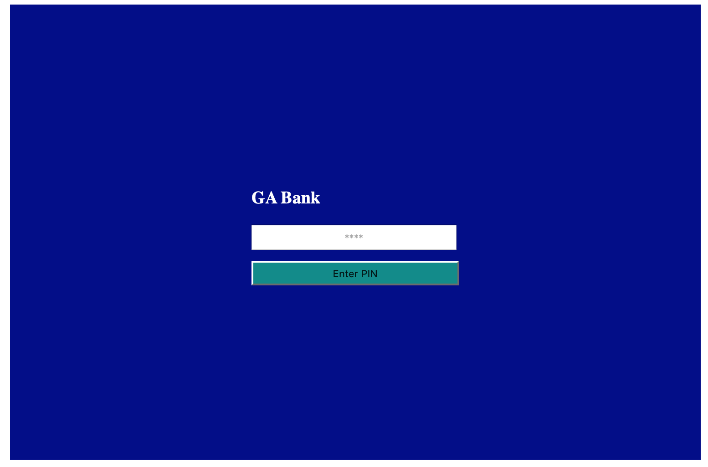

## Jquery ATM Lab

Today we will be building a bank with Jquery to test how much you have learnt so far.

### Screenshot of bank pages

## Story

Default balance for each account is `SAR 10000`. We want to have some sort of security system for this bank, so we have included a pin if the pin is wrong the user gets an error message `wrong pin` if the pin is right user can carry on to either deposit or withdraw.

---

### Important Links

- [NaN](https://www.w3schools.com/jsref/jsref_isnan.asp)
- [parseInt](https://www.w3schools.com/jsref/jsref_parseint.asp)
- [parseFloat](https://www.w3schools.com/jsref/jsref_parsefloat.asp)
